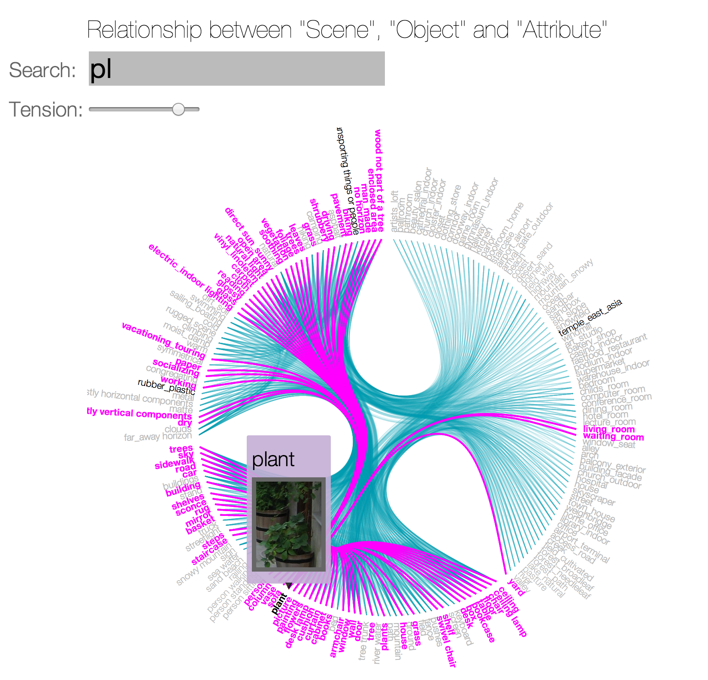

a3-izadinia-fsadeghi
===============

## Team Members

1. Hamid Izadinia izadinia@uw.edu
2. Fereshteh Sadeghi fsadeghi@uw.edu

## Project Name

The data domain of our visualization is the SUN database which contains images from 717 scene types. Each of the images in this database has a list of attributes (maximum of 102 attributes) and a portion of images come with the bounding box annotation of the prominent objects occurring in that image. This database is used in analyzing the visual appearance of different types of natural scenes and their properties in the field of Computer Vision. One well-know assumption for discriminating between different scenes is that different types of scene are tied with particular group of objects and attributes so it is very important to see the relation between the co-occurrence of different attributes, objects within scenes. Here, we conduct a visualization that helps us see the relationships between different types of scenes, objects and attributes. Due to the very large number of categories, we have limited our visualization to a subset of high frequency objects attributes and scenes.

## Running Instructions

This is a web-based visualization project and can be opened online at (http://cse512-14w.github.io/a3-izadinia-fsadeghi/). 
** [IMPORTANT] The project looks much nicer in chrome with full screen mode. After you made it full screen then refresh it again. **

Using this link you will open index.html file and run the visualization. We use bundle layout in D3 to show the link between different nominal variables. Here we have three types of variables: 

1) Scene: dining room, mountain, ...
2) Object: chair, table, ...
3) Attribute: indoor, outdoor, natural, ...

The link between each variable show the concurrence of those variables in the image set. Since there are many variables in the graph, you can search for specific string in the search box on top of the page. The variables with similar pattern will get highlighted and then by moving mouse over the variable of interest, the link of that variable with other variables get highlighted. Then by clicking on the text of that variable a popup will open and show the thumbnail of a sample image for each category. 

## Story Board

We started with a parallel coordinate theme but, we saw that it is not effective for this visualization task, we switched to the bundle layout. Using bundle layout we can show the nominal variables and their links effectively.

### Initial Idea

Initially, we had the idea of using a parallel coordinate theme for showing the attributes that co-occur in different images. In this visualization, we considered our list of images and for each image we had a binary vector of attributes. So, we wanted to visualize the amount of different attributes on the parallel coordinates and line colors would show different scenes. However, we figured out that this visualization is not effective for our task since our dimensions are all nominal and this could not be visualized well in a parallel coordinate theme. Also we could not embed the objects in this visualization and it would not show the relationship between the objects, attributes and scenes at the same time. Here is a sketch of this initial idea:

### Revised Idea

For showing the relationship between different objects, scenes and attributes we came up with the idea of making the co-occurrence matrix for any two-by-two elements. After constructing the relation matrix, we used a graph where nodes are any of the components (attributes, objects and scenes) and used an bundle layout for visualizing the relations. Here is an early sketch of our revised idea:

### Final Sketch

After implementing our idea and playing around with it, we figured out due to the large number of labels, it is sometimes hard for the user to find a particular label easily and one needs to go through all the labels one by one until he finds a particular label.  
So we added a search property to our visualization. In the search scenario, the user can search for a particular keyword (which could be name of a scene, object or attribute) and the related labels will be highlighted. Then user can move mouse over label of interest among highlighted labels and see the connected labels to that label. The link of connected labels are highlighted by different color. 

 
Also, for improving the expressiveness of our visualization, we embedded the thumbnail of the images of different objects, attributes and scenes in a "mouse click" action. In this case, the user can check the visual appearance of his selected label via a "mouse click" action.

The screenshot of the final implementation is shown below.

## Development Process

The workload of the project is divided in every step. The details are as follows:

- discuss about the dataset and rough sketch of interactive visualization in first stages. (Fereshteh Sadeghi: 4 hrs, Hamid Izadinia: 4 hrs)
- getting familiar with html,css,d3 by reading TA materials (Fereshteh Sadeghi: 5 hrs, Hamid Izadinia: 5 hrs)
- reading tutorials and seeing the d3 visualization examples in web (Fereshteh Sadeghi: 9 hrs, Hamid Izadinia: 8 hrs)
- making data ready for visualization including computing the statistics from the dataset, finding the important elements and converting the data format to JSON which is d3 friendly. (Fereshteh Sadeghi: 15 hrs, Hamid Izadinia: 3 hrs)
- implementing our visualization and playing with different styles such that the visualization interface looks better. (Fereshteh Sadeghi: 9 hrs, Hamid Izadinia: 22 hrs)

